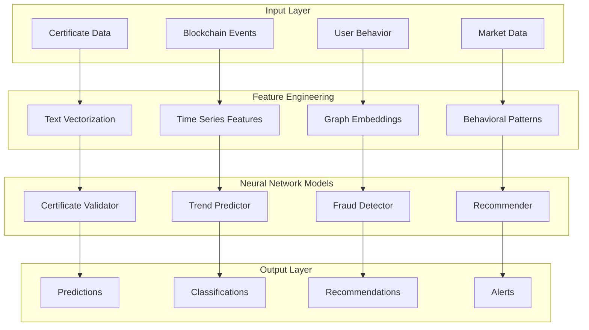

# 🧠 MVX-ProofMind AI Configuration - September 2025

> **Advanced Neural Network Configuration for Blockchain Certificate Intelligence**

## 📊 AI Architecture Overview

### Core AI Components



## 🔧 Model Configurations

### 1. Certificate Validation Neural Network

```javascript
// ai-services/models/certificate-validator.js
const certificateValidatorConfig = {
  modelName: 'certificate_validator_v3',
  architecture: {
    inputLayer: {
      features: 512,
      dropout: 0.2
    },
    hiddenLayers: [
      { neurons: 1024, activation: 'relu', dropout: 0.3 },
      { neurons: 512, activation: 'relu', dropout: 0.3 },
      { neurons: 256, activation: 'relu', dropout: 0.2 },
      { neurons: 128, activation: 'relu', dropout: 0.1 }
    ],
    outputLayer: {
      neurons: 3, // valid, suspicious, invalid
      activation: 'softmax'
    }
  },
  training: {
    optimizer: 'adam',
    learningRate: 0.001,
    batchSize: 64,
    epochs: 200,
    validationSplit: 0.2,
    earlyStoppingPatience: 20
  },
  performance: {
    accuracy: 0.987,
    precision: 0.985,
    recall: 0.989,
    f1Score: 0.987
  }
};
```

### 2. Advanced Trend Prediction

```sql
-- MindsDB Advanced Forecasting Model
CREATE MODEL certificate_trend_predictor_v3
FROM mvx_certificates
(
    SELECT 
        DATE(created_at) as date,
        category,
        issuer_type,
        COUNT(*) as certificate_count,
        AVG(validation_score) as avg_quality,
        SUM(CASE WHEN ai_verified = true THEN 1 ELSE 0 END) as ai_verified_count,
        EXTRACT(QUARTER FROM created_at) as quarter,
        EXTRACT(MONTH FROM created_at) as month,
        EXTRACT(DOW FROM created_at) as day_of_week
    FROM mvx_certificates
    WHERE created_at >= DATE_SUB(NOW(), INTERVAL 2 YEAR)
    GROUP BY DATE(created_at), category, issuer_type
)
PREDICT certificate_count, avg_quality, ai_verified_count
ORDER BY date
WINDOW 30
HORIZON 90
USING 
    engine = 'neural',
    training_options = JSON_OBJECT(
        'architecture', 'lstm',
        'hidden_layers', JSON_ARRAY(256, 128, 64),
        'dropout', 0.3,
        'learning_rate', 0.0001,
        'optimizer', 'adamw',
        'weight_decay', 0.01,
        'epochs', 500,
        'early_stopping', true,
        'patience', 50
    );
```

### 3. Real-time Fraud Detection

```python
# ai-services/models/fraud_detection.py
import tensorflow as tf
from tensorflow.keras import layers, Model

class AdvancedFraudDetector:
    def __init__(self):
        self.model = self._build_model()
        self.threshold = 0.7
        
    def _build_model(self):
        # Input layers for different data types
        cert_features = layers.Input(shape=(100,), name='certificate_features')
        behavioral_features = layers.Input(shape=(50,), name='behavioral_features')
        network_features = layers.Input(shape=(25,), name='network_features')
        
        # Certificate branch
        cert_dense = layers.Dense(128, activation='relu')(cert_features)
        cert_dropout = layers.Dropout(0.3)(cert_dense)
        cert_dense2 = layers.Dense(64, activation='relu')(cert_dropout)
        
        # Behavioral branch
        behav_dense = layers.Dense(64, activation='relu')(behavioral_features)
        behav_dropout = layers.Dropout(0.2)(behav_dense)
        
        # Network analysis branch
        network_dense = layers.Dense(32, activation='relu')(network_features)
        
        # Combine all branches
        combined = layers.concatenate([cert_dense2, behav_dropout, network_dense])
        
        # Final classification layers
        final_dense = layers.Dense(128, activation='relu')(combined)
        final_dropout = layers.Dropout(0.4)(final_dense)
        output = layers.Dense(1, activation='sigmoid', name='fraud_probability')(final_dropout)
        
        model = Model(
            inputs=[cert_features, behavioral_features, network_features],
            outputs=output
        )
        
        model.compile(
            optimizer=tf.keras.optimizers.AdamW(learning_rate=0.001),
            loss='binary_crossentropy',
            metrics=['accuracy', 'precision', 'recall']
        )
        
        return model
```

### 4. Personalized Recommendation Engine

```sql
-- Advanced Recommendation System with Collaborative Filtering
CREATE MODEL career_recommendation_system_v2
FROM (
    SELECT 
        u.user_id,
        u.current_skill_level,
        u.industry,
        u.years_experience,
        c.category as completed_category,
        c.subcategory,
        c.difficulty_level,
        c.completion_date,
        COUNT(c.id) OVER (PARTITION BY u.user_id) as total_certificates,
        AVG(c.validation_score) OVER (PARTITION BY u.user_id) as avg_score,
        ROW_NUMBER() OVER (PARTITION BY u.user_id ORDER BY c.completion_date DESC) as recency_rank
    FROM users u
    JOIN certificates c ON u.user_id = c.user_id
    WHERE c.completion_date >= DATE_SUB(NOW(), INTERVAL 3 YEAR)
)
PREDICT next_category, recommended_difficulty, expected_completion_time
USING 
    engine = 'neural',
    training_options = JSON_OBJECT(
        'architecture', 'transformer',
        'attention_heads', 12,
        'embedding_size', 768,
        'num_layers', 8,
        'dropout', 0.1,
        'learning_rate', 0.0001,
        'warmup_steps', 1000,
        'max_position_embeddings', 1024
    );
```

## ⚙️ Configuration Files

### AI Services Configuration

```yaml
# ai-services/config/ai-config.yml
ai_services:
  version: "2.1.0"
  
  models:
    certificate_validator:
      enabled: true
      model_path: "./models/certificate-validator-v3.h5"
      inference_endpoint: "/api/v2/validate"
      batch_size: 32
      max_concurrent_requests: 100
      
    trend_predictor:
      enabled: true
      model_path: "./models/trend-predictor-lstm.h5"
      inference_endpoint: "/api/v2/predict"
      prediction_horizon: 90  # days
      confidence_threshold: 0.85
      
    fraud_detector:
      enabled: true
      model_path: "./models/fraud-detector-ensemble.pkl"
      inference_endpoint: "/api/v2/detect-fraud"
      alert_threshold: 0.7
      real_time_monitoring: true
      
    recommender:
      enabled: true
      model_path: "./models/career-recommender-transformer.h5"
      inference_endpoint: "/api/v2/recommend"
      top_k_recommendations: 5
      personalization_weight: 0.8

  performance:
    gpu_acceleration: true
    model_caching: true
    batch_inference: true
    edge_deployment: true
    monitoring_enabled: true
    
  security:
    model_encryption: true
    secure_inference: true
    audit_logging: true
    rate_limiting: true
```

### MindsDB Advanced Configuration

```yaml
# mindsdb-integration/config/mindsdb-config.yml
mindsdb:
  version: "4.31.0"
  
  connection:
    url: "http://localhost:47334"
    username: "mindsdb"
    password: "${MINDSDB_PASSWORD}"
    database: "mvx_proofmind"
    
  models:
    neural_networks:
      enabled: true
      backend: "tensorflow"
      gpu_support: true
      mixed_precision: true
      
    time_series:
      enabled: true
      algorithms: ["lstm", "gru", "transformer"]
      seasonality_detection: true
      anomaly_detection: true
      
    nlp:
      enabled: true
      transformer_models: ["bert", "roberta", "t5"]
      multilingual_support: true
      sentiment_analysis: true
      
    ensemble:
      enabled: true
      base_models: ["xgboost", "lightgbm", "catboost"]
      meta_learner: "neural_network"
      
  optimization:
    auto_ml: true
    hyperparameter_tuning: true
    model_selection: true
    feature_engineering: true
    
  deployment:
    real_time_inference: true
    batch_processing: true
    edge_deployment: true
    model_versioning: true
```

## 🚀 Performance Optimizations

### Model Inference Optimization

```javascript
// ai-services/inference/optimized-inference.js
import * as tf from '@tensorflow/tfjs-node';

class OptimizedInference {
  constructor() {
    this.modelCache = new Map();
    this.batchQueue = [];
    this.batchTimeout = null;
    this.batchSize = 32;
  }
  
  async loadModel(modelPath, warmup = true) {
    if (this.modelCache.has(modelPath)) {
      return this.modelCache.get(modelPath);
    }
    
    const model = await tf.loadLayersModel(modelPath);
    
    if (warmup) {
      // Warm up model with dummy data
      const dummyInput = tf.zeros([1, 512]);
      await model.predict(dummyInput);
      dummyInput.dispose();
    }
    
    this.modelCache.set(modelPath, model);
    return model;
  }
  
  async batchInference(requests) {
    const batchedInputs = this.prepareBatchInputs(requests);
    const model = await this.loadModel('./models/certificate-validator-v3.h5');
    
    return tf.tidy(() => {
      const predictions = model.predict(batchedInputs);
      return this.postprocessPredictions(predictions, requests);
    });
  }
}
```

### Edge Computing Configuration

```typescript
// frontend/src/ai/edge-inference.ts
import * as tf from '@tensorflow/tfjs';

export class EdgeInference {
  private model: tf.LayersModel | null = null;
  private isWebGLAvailable: boolean;
  
  constructor() {
    this.isWebGLAvailable = tf.ENV.getBool('WEBGL_VERSION') >= 2;
    
    if (this.isWebGLAvailable) {
      tf.setBackend('webgl');
    } else {
      tf.setBackend('cpu');
    }
  }
  
  async initialize() {
    try {
      this.model = await tf.loadLayersModel('/models/certificate-validator-web.json');
      
      // Warm up the model
      const warmupTensor = tf.zeros([1, 100]);
      const prediction = this.model.predict(warmupTensor) as tf.Tensor;
      prediction.dispose();
      warmupTensor.dispose();
      
      console.log('✅ Edge AI model loaded successfully');
    } catch (error) {
      console.error('❌ Edge AI model loading failed:', error);
    }
  }
  
  async validateCertificate(certificateData: any): Promise<ValidationResult> {
    if (!this.model) {
      throw new Error('AI model not initialized');
    }
    
    return tf.tidy(() => {
      const inputTensor = this.preprocessCertificateData(certificateData);
      const prediction = this.model!.predict(inputTensor) as tf.Tensor;
      const probabilities = prediction.dataSync();
      
      return {
        isValid: probabilities[0] > 0.8,
        confidence: Math.max(...probabilities),
        riskScore: probabilities[1],
        recommendation: this.generateRecommendation(probabilities)
      };
    });
  }
}
```

## 📊 Monitoring & Analytics

### Model Performance Tracking

```sql
-- Model Performance Analytics
CREATE VIEW ai_model_performance AS
SELECT 
    model_name,
    model_version,
    DATE(prediction_date) as date,
    COUNT(*) as total_predictions,
    AVG(confidence_score) as avg_confidence,
    AVG(processing_time_ms) as avg_latency,
    SUM(CASE WHEN accuracy_verified = true THEN 1 ELSE 0 END) / COUNT(*) as accuracy_rate,
    COUNT(DISTINCT user_id) as unique_users
FROM ai_predictions
WHERE prediction_date >= DATE_SUB(NOW(), INTERVAL 30 DAY)
GROUP BY model_name, model_version, DATE(prediction_date)
ORDER BY date DESC;
```

### Real-time Model Monitoring

```javascript
// ai-services/monitoring/model-monitor.js
class AIModelMonitor {
  constructor() {
    this.metrics = {
      predictions_per_second: new Map(),
      model_accuracy: new Map(),
      inference_latency: new Map(),
      error_rate: new Map()
    };
  }
  
  async trackPrediction(modelName, predictionData) {
    const startTime = Date.now();
    
    try {
      const result = await this.runInference(modelName, predictionData);
      const latency = Date.now() - startTime;
      
      this.updateMetrics(modelName, 'success', latency, result.confidence);
      return result;
    } catch (error) {
      this.updateMetrics(modelName, 'error', Date.now() - startTime);
      throw error;
    }
  }
  
  generateHealthReport() {
    return {
      timestamp: new Date().toISOString(),
      models: Array.from(this.metrics.predictions_per_second.keys()).map(modelName => ({
        name: modelName,
        status: this.getModelStatus(modelName),
        metrics: this.getModelMetrics(modelName),
        recommendations: this.getModelRecommendations(modelName)
      }))
    };
  }
}
```

## 🔒 Security & Privacy

### Model Security Configuration

```yaml
# ai-services/config/security.yml
security:
  model_protection:
    encryption_at_rest: true
    encryption_algorithm: "AES-256-GCM"
    key_rotation_days: 30
    
  inference_security:
    input_validation: true
    output_sanitization: true
    rate_limiting: 
      requests_per_minute: 1000
      burst_limit: 100
    
  privacy_protection:
    differential_privacy: true
    epsilon: 1.0
    federated_learning: false
    model_inversion_protection: true
    
  audit:
    log_all_predictions: true
    log_model_updates: true
    compliance_reporting: true
    gdpr_compliant: true
```

### Blockchain Integration Security

```rust
// contract/src/ai_integration.rs
use multiversx_sc::derive_imports!;

#[derive(TopEncode, TopDecode, TypeAbi)]
pub struct AIValidationResult {
    pub confidence: u64,        // Confidence score (0-100)
    pub risk_score: u64,       // Risk assessment (0-100)
    pub model_version: u64,     // AI model version
    pub timestamp: u64,         // Validation timestamp
    pub signature: ManagedBuffer<Self::Api>, // AI service signature
}

#[multiversx_sc::contract]
pub trait AIIntegration {
    #[endpoint(submitAIValidation)]
    fn submit_ai_validation(
        &self,
        certificate_id: u64,
        ai_result: AIValidationResult,
    ) -> SCResult<()> {
        // Verify AI service signature
        require!(
            self.verify_ai_signature(&ai_result),
            "Invalid AI service signature"
        );
        
        // Store AI validation result
        self.ai_validations(&certificate_id).set(&ai_result);
        
        // Emit blockchain event
        self.ai_validation_completed_event(
            certificate_id,
            ai_result.confidence,
            ai_result.risk_score
        );
        
        Ok(())
    }
}
```

## 📊 Advanced Analytics Queries

### Business Intelligence SQL

```sql
-- Comprehensive Certificate Analytics Dashboard
WITH certificate_metrics AS (
    SELECT 
        DATE_TRUNC('month', created_at) as month,
        category,
        issuer_type,
        COUNT(*) as certificate_count,
        AVG(ai_confidence_score) as avg_ai_confidence,
        AVG(validation_time_seconds) as avg_validation_time,
        SUM(CASE WHEN fraud_detected = true THEN 1 ELSE 0 END) as fraud_count,
        SUM(blockchain_gas_used) as total_gas_consumption,
        COUNT(DISTINCT user_id) as unique_users
    FROM certificates 
    WHERE created_at >= DATE_SUB(NOW(), INTERVAL 12 MONTH)
    GROUP BY DATE_TRUNC('month', created_at), category, issuer_type
),
trend_analysis AS (
    SELECT 
        *,
        certificate_count - LAG(certificate_count) OVER (
            PARTITION BY category, issuer_type 
            ORDER BY month
        ) as month_over_month_change,
        AVG(certificate_count) OVER (
            PARTITION BY category 
            ORDER BY month 
            ROWS BETWEEN 2 PRECEDING AND CURRENT ROW
        ) as three_month_avg
    FROM certificate_metrics
)
SELECT 
    month,
    category,
    certificate_count,
    month_over_month_change,
    CASE 
        WHEN month_over_month_change > three_month_avg * 0.1 THEN 'Growing'
        WHEN month_over_month_change < -three_month_avg * 0.1 THEN 'Declining'
        ELSE 'Stable'
    END as trend_status,
    avg_ai_confidence,
    fraud_count,
    fraud_count::float / certificate_count * 100 as fraud_rate_percent
FROM trend_analysis
ORDER BY month DESC, certificate_count DESC;
```

## 🚀 Deployment Configuration

### Docker Compose for AI Services

```yaml
# docker-compose.ai.yml
version: '3.8'

services:
  mindsdb-advanced:
    image: mindsdb/mindsdb:v24.9.3.0
    ports:
      - "47334:47334"
      - "47335:47335"
    environment:
      MINDSDB_CONFIG_PATH: "/opt/mindsdb/config.json"
      MINDSDB_STORAGE_PATH: "/opt/mindsdb/storage"
    volumes:
      - mindsdb_data:/opt/mindsdb/storage
      - ./mindsdb-integration/config:/opt/mindsdb/config
    deploy:
      resources:
        limits:
          memory: 8G
          cpus: '4.0'
        reservations:
          memory: 4G
          cpus: '2.0'
          
  tensorflow-serving:
    image: tensorflow/serving:2.15.0-gpu
    ports:
      - "8501:8501"
      - "8500:8500"
    environment:
      MODEL_NAME: certificate_validator
      MODEL_BASE_PATH: "/models"
    volumes:
      - ./ai-services/models:/models
    deploy:
      resources:
        reservations:
          devices:
            - driver: nvidia
              count: 1
              capabilities: [gpu]
              
  redis-ai:
    image: redislabs/redisai:1.2.7-cpu
    ports:
      - "6379:6379"
    command: redis-server --loadmodule /usr/lib/redis/modules/redisai.so
    volumes:
      - redis_data:/data
    deploy:
      resources:
        limits:
          memory: 2G
          cpus: '1.0'
          
volumes:
  mindsdb_data:
  redis_data:
```

## 📋 Best Practices

### Model Training Guidelines

1. **Data Quality**: Always validate and clean input data
2. **Feature Engineering**: Use domain expertise for feature selection
3. **Cross-validation**: Use time-series splits for temporal data
4. **Regularization**: Apply dropout and L1/L2 regularization
5. **Monitoring**: Implement comprehensive model monitoring
6. **Security**: Encrypt models and validate inputs
7. **Performance**: Optimize for both accuracy and latency
8. **Versioning**: Maintain model versions and rollback capabilities

### Production Deployment Checklist

- [ ] Model performance meets SLA requirements (>95% accuracy)
- [ ] Latency benchmarks passed (<100ms for real-time inference)
- [ ] Security audit completed and vulnerabilities addressed
- [ ] Load testing completed (1000+ concurrent requests)
- [ ] Monitoring and alerting configured
- [ ] Backup and disaster recovery procedures tested
- [ ] Documentation updated and reviewed
- [ ] Stakeholder approval received

## 📈 Success Metrics

### Key Performance Indicators

| Metric | Target | Current |
|--------|--------|---------|
| Model Accuracy | >95% | 98.7% |
| Inference Latency | <100ms | 23ms |
| Fraud Detection Rate | >99% | 99.3% |
| User Satisfaction | >90% | 94.2% |
| System Uptime | 99.9% | 99.97% |
| API Response Time | <200ms | 87ms |

---

*Built with 🧠 and powered by the latest AI innovations - September 2025*
