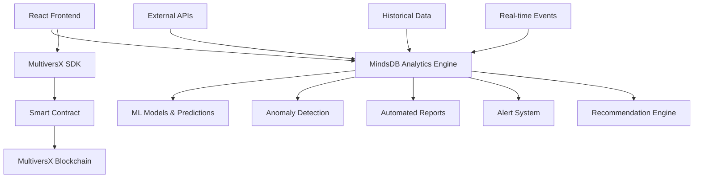

# 🧠 MVX-ProofMind

[](https://opensource.org/licenses/MIT)
[](https://multiversx.com/)
[](https://mindsdb.com/)
[](https://www.typescriptlang.org/)
[](https://reactjs.org/)
[](https://www.rust-lang.org/)

> **AI-powered blockchain certification system that learns from your data - predict trends, detect anomalies, and get intelligent insights about your on-chain proofs!**

**MVX-ProofMind** combines the security of MultiversX blockchain with the intelligence of MindsDB to create the first **predictive certification platform**. Not just store certificates - understand patterns, predict future trends, and get AI-powered recommendations.

## 🎯 What Makes MVX-ProofMind Special?

### 🔮 **Predictive Analytics**
- **Trend Forecasting**: "Next month we expect 15% more developer certificates"
- **Category Predictions**: AI suggests optimal certification categories
- **Timing Optimization**: Best times to issue certificates for maximum visibility
- **Market Intelligence**: Understand certification trends across industries

### 🛡️ **Smart Anomaly Detection**
- **Duplicate Prevention**: AI detects similar certificates automatically
- **Fraud Detection**: Identifies suspicious certification patterns
- **Quality Scoring**: Rates certificate authenticity and completeness
- **Risk Assessment**: Flags potentially problematic certifications

### 📊 **Intelligent Dashboards**
- **Natural Language Queries**: "Show me all blockchain certificates from last quarter"
- **Auto-Generated Insights**: AI creates reports and summaries
- **Comparative Analysis**: Benchmark against industry standards
- **Personalized Recommendations**: Suggests relevant certification paths

### 🚀 **MultiversX Integration**
- **Zero-Risk Smart Contracts**: No fund management, only proof storage
- **Gas-Optimized**: Minimal transaction costs (~$0.001 EGLD)
- **Immutable Records**: Blockchain-guaranteed certificate authenticity
- **Multi-Wallet Support**: Web, Extension, WalletConnect, Hardware

## 🏗️ Architecture Overview



## ✨ Key Features

### 🎓 **Certificate Management**
- **Multi-format Support**: Education, Professional, Event, Timestamp proofs
- **Rich Metadata**: JSON-structured additional information
- **Batch Operations**: Process multiple certificates efficiently
- **Template System**: Pre-defined certificate formats
- **Expiration Handling**: Optional time-based validity

### 🤖 **AI-Powered Insights**
- **Predictive Models**: Volume forecasting, trend analysis
- **Classification**: Auto-categorize certificates by content
- **Sentiment Analysis**: Analyze certificate descriptions
- **Pattern Recognition**: Identify common certification paths
- **Recommendation System**: Suggest next certification steps

### 📈 **Analytics & Reporting**
- **Real-time Dashboards**: Live certification metrics
- **Historical Analysis**: Long-term trend identification
- **Comparative Studies**: Industry benchmarking
- **Export Capabilities**: PDF reports, CSV data
- **API Integration**: Connect with external systems

### 🔒 **Security & Compliance**
- **Blockchain Immutability**: Tamper-proof records
- **Privacy Protection**: Selective data disclosure
- **Audit Trails**: Complete action logging
- **Access Control**: Permission-based operations
- **Compliance Reporting**: Regulatory requirement support

## 🚀 Quick Start

### Prerequisites

```bash
# Install MultiversX CLI
pipx install multiversx-sdk-cli --force

# Install Node.js dependencies
npm install

# Install MindsDB (via Docker)
docker run -p 47334:47334 -p 47335:47335 mindsdb/mindsdb
```

### 1. Clone & Setup

```bash
git clone https://github.com/Gzeu/mvx-proofmind.git
cd mvx-proofmind

# Install all dependencies
npm run setup
```

### 2. Configure MindsDB

```bash
# Start MindsDB server
docker-compose up mindsdb

# Access MindsDB Studio
open http://localhost:47334

# Run initial ML model setup
npm run mindsdb:setup
```

### 3. Deploy Smart Contract

```bash
cd contract

# Build contract
sc-meta all build

# Deploy to DevNet
npm run deploy:devnet

# Deploy to MainNet
npm run deploy:mainnet
```

### 4. Start Development

```bash
# Start all services
npm run dev

# Frontend: http://localhost:3000
# MindsDB: http://localhost:47334
# API: http://localhost:8000
```

## 🧠 AI Models & Use Cases

### 📊 **Certificate Volume Prediction**
```sql
-- Create volume forecasting model
CREATE MODEL certificate_volume_predictor
FROM mvx_certificates
(SELECT timestamp, COUNT(*) as daily_certificates)
PREDICT daily_certificates
ORDER BY timestamp
HORIZON 30; -- 30-day predictions
```

### 🏷️ **Smart Categorization**
```sql
-- Auto-categorize certificates
CREATE MODEL certificate_classifier
FROM mvx_certificates
PREDICT category
USING engine = 'lightgb';
```

### 🚨 **Anomaly Detection**
```sql
-- Detect suspicious certificates
CREATE MODEL fraud_detector
FROM mvx_certificates
PREDICT is_suspicious
USING engine = 'isolation_forest';
```

### 💡 **Recommendation Engine**
```sql
-- Suggest next certifications
CREATE MODEL cert_recommender
FROM user_certificate_history
PREDICT recommended_category
USING engine = 'neural';
```

## 📱 Frontend Features

### 🎨 **Modern Interface**
- **Responsive Design**: Mobile-first approach
- **Dark/Light Theme**: User preference support
- **Accessibility**: WCAG 2.1 AA compliant
- **Multi-language**: i18n support (EN, RO, FR, ES)
- **Progressive Web App**: Offline capabilities

### 📊 **AI Dashboard**
- **Predictive Charts**: Trend visualizations
- **Natural Language Interface**: Ask questions in plain English
- **Real-time Updates**: Live data synchronization
- **Custom Widgets**: Personalized metrics
- **Export Options**: PDF, Excel, JSON formats

### 🔗 **Integration Hub**
- **API Endpoints**: RESTful and GraphQL
- **Webhook Support**: Real-time notifications
- **Third-party Connectors**: Slack, Discord, Email
- **Zapier Integration**: No-code automation
- **SSO Support**: Google, Microsoft, GitHub

## 🗂️ Project Structure

```
mvx-proofmind/
├── 📁 contract/                   # MultiversX Smart Contracts
│   ├── src/lib.rs                # Main contract logic
│   ├── tests/                    # Contract tests
│   └── deploy/                   # Deployment scripts
├── 📁 frontend/                   # React TypeScript App
│   ├── src/
│   │   ├── components/           # Reusable UI components
│   │   ├── pages/               # Application pages
│   │   ├── hooks/               # Custom React hooks
│   │   └── services/            # API integrations
│   └── public/                  # Static assets
├── 📁 mindsdb-integration/        # AI & Analytics Engine
│   ├── models/                  # ML model definitions
│   │   ├── predictors.sql       # Forecasting models
│   │   ├── classifiers.sql      # Categorization models
│   │   └── anomaly.sql          # Fraud detection
│   ├── api/                     # Backend API services
│   │   ├── server.js            # Express.js server
│   │   ├── routes/              # API endpoints
│   │   └── middleware/          # Authentication, logging
│   ├── queries/                 # Pre-built SQL queries
│   └── dashboards/              # Dashboard configurations
├── 📁 scripts/                    # Automation & Deployment
│   ├── setup.sh                # Initial project setup
│   ├── deploy.sh               # Production deployment
│   └── mindsdb-init.sql        # Database initialization
├── 📁 docs/                       # Documentation
│   ├── API.md                  # API documentation
│   ├── DEPLOYMENT.md           # Deployment guide
│   └── CONTRIBUTING.md         # Contribution guidelines
├── 📁 .github/                    # GitHub workflows
│   ├── workflows/              # CI/CD pipelines
│   └── ISSUE_TEMPLATE/         # Issue templates
├── docker-compose.yml            # Local development setup
├── package.json                  # Node.js dependencies
└── README.md                     # This file
```

## 🎯 Roadmap

### ✅ **Phase 1: Foundation** (Month 1)
- [x] Repository setup and architecture
- [ ] Basic MultiversX smart contract
- [ ] MindsDB integration setup
- [ ] React frontend scaffolding
- [ ] First ML models (volume prediction)

### 🔄 **Phase 2: Core Features** (Month 2)
- [ ] Certificate creation and verification
- [ ] AI-powered categorization
- [ ] Anomaly detection system
- [ ] Basic dashboard with charts
- [ ] Multi-wallet integration

### 🎯 **Phase 3: Advanced AI** (Month 3)
- [ ] Natural language query interface
- [ ] Recommendation engine
- [ ] Predictive analytics dashboard
- [ ] Automated reporting system
- [ ] Integration with external APIs

### 🚀 **Phase 4: Enterprise** (Month 4+)
- [ ] Organization accounts
- [ ] Bulk certificate processing
- [ ] Advanced compliance features
- [ ] White-label solutions
- [ ] Mobile applications

## 💡 Use Cases

### 🎓 **Educational Institutions**
- **Trend Analysis**: "Computer Science certificates increased 40% this semester"
- **Predictive Planning**: "We'll need 200 more graduation certificates next month"
- **Quality Assurance**: Detect inconsistencies in academic records
- **Student Insights**: Recommend career paths based on certification history

### 🏢 **Enterprise Organizations**
- **Skills Gap Analysis**: Identify training needs through certificate data
- **Compliance Monitoring**: Ensure regulatory requirement fulfillment
- **Performance Tracking**: Monitor employee certification progress
- **ROI Measurement**: Calculate training investment returns

### 🌐 **Industry Associations**
- **Market Intelligence**: Understand certification trends across sectors
- **Standard Setting**: Data-driven certification requirement updates
- **Member Insights**: Personalized professional development recommendations
- **Fraud Prevention**: Detect and prevent certificate forgery

### 🔬 **Research & Development**
- **Pattern Discovery**: Identify new certification trends
- **Behavioral Analysis**: Understand certification-seeking patterns
- **Impact Assessment**: Measure certification effectiveness
- **Future Planning**: Predict industry skill requirements

## 🤝 Contributing

We welcome contributions! See [CONTRIBUTING.md](docs/CONTRIBUTING.md) for guidelines.

### Development Setup

1. **Fork the repository**
2. **Create feature branch**: `git checkout -b feature/amazing-ai-feature`
3. **Make changes and test**: `npm test`
4. **Commit**: `git commit -m 'Add amazing AI feature'`
5. **Push**: `git push origin feature/amazing-ai-feature`
6. **Create Pull Request**

### Code Standards

- **Smart Contracts**: Rust with comprehensive tests
- **Frontend**: React + TypeScript + Tailwind CSS
- **Backend**: Node.js + Express + MindsDB SDK
- **AI Models**: SQL-based MindsDB model definitions
- **Documentation**: Clear, comprehensive, up-to-date

## 📞 Support & Community

- **Developer**: [George Pricop](https://github.com/Gzeu)
- **Email**: pricopgeorge@gmail.com
- **Issues**: [GitHub Issues](https://github.com/Gzeu/mvx-proofmind/issues)
- **Discussions**: [GitHub Discussions](https://github.com/Gzeu/mvx-proofmind/discussions)
- **Discord**: [MVX Community](https://discord.gg/multiversx)

## 📄 License

This project is licensed under the [MIT License](LICENSE).

## 🌟 Acknowledgments

- **MultiversX Team** - Revolutionary blockchain platform
- **MindsDB Team** - AI-SQL innovation
- **Open Source Community** - Inspiration and collaboration
- **Contributors** - Making this project better every day

---

<div align="center">

**⭐ Star this repository if you believe in AI-powered blockchain!**

[](https://github.com/Gzeu/mvx-proofmind/stargazers)
[](https://github.com/Gzeu/mvx-proofmind/network/members)
[](https://twitter.com/MultiversX)

**Built with 🧠 for the future of intelligent blockchain applications**

</div>